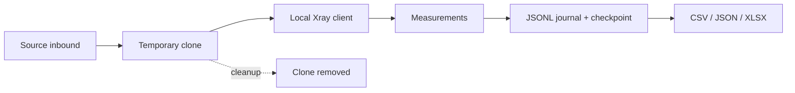

<p align="center">
  <a href="README.md">English</a> · <a href="README.ru_RU.md">Русский</a>
</p>

<p align="center">
  
</p>

<p align="center">
  <a href="https://github.com/OctoberIsTired/3xui-config-tester/actions/workflows/tests.yml"></a>
  
  
  
  
</p>

<p align="center">
  Test 3x-ui inbound configurations with a temporary clone, a local Xray client,
  repeatable measurements, and resumable results.
</p>

> [!NOTE]
> 3xui-config-tester is an independent tool for [3x-ui](https://github.com/MHSanaei/3x-ui).
> It is not part of the 3x-ui project.

## Why use it?

Changing a live inbound to compare transports and client settings is slow and
risky. 3xui-config-tester builds a bounded experiment, tests each candidate through a
local Xray client, and writes every result to a durable journal. The default
`clone` mode leaves the source inbound unchanged.

| Plan | Measure | Recover |
| --- | --- | --- |
| Pairwise coverage, exhaustive search, or adaptive mutation. | TCP, ICMP, HTTP latency and p95, stability, and optional bounded download speed. | Journal and checkpoint after each run; resume unfinished work and export JSON, CSV, or XLSX. |



## Quick start

You need Git, Python 3.12+, [uv](https://docs.astral.sh/uv/), a local Xray
binary, access to the 3x-ui API, and a route from the test machine to the
temporary inbound. The adapter has been tested with 3x-ui v3.8.0 and Xray v26.9.9;
each run also checks the live panel's OpenAPI before changing an inbound.

```bash
git clone https://github.com/OctoberIsTired/3xui-config-tester.git
cd 3xui-config-tester
uv sync
cp configs/example.yaml configs/local.yaml
export PANEL_API_TOKEN='your-panel-api-token'
```

Edit `configs/local.yaml`: set `panel.url`, `inbound.source_id`, the public
`testing.server_address`, and `testing.xray_binary`. On Windows, use
`Copy-Item configs/example.yaml configs/local.yaml` and set the token with
`$env:PANEL_API_TOKEN = 'your-panel-api-token'` in PowerShell. Keep credentials
in environment variables; `configs/local.yaml` is ignored by Git.

To include REALITY when the source inbound uses TLS, also set
`testing.reality.target` (a TLS destination such as `www.example.com:443`) and
`testing.reality.server_names` (matching SNI names). The example leaves them
commented out so you can choose a destination suitable for your server. The
tester generates matching X25519 keys and a `shortId` for the experiment.

To compare several REALITY destinations, use `testing.reality.candidates_file:
reality-targets.yaml` in a config under `configs/`, or upload a YAML file in the
Connection tab. The file contains `targets:` entries with `target` (`host:port`)
and `server_name` (one SNI). The shipped
[`configs/reality-targets.yaml`](configs/reality-targets.yaml) contains ten
candidate seeds from 3x-ui; they are checked from the panel server before a
run. An uploaded list is saved as `testing.reality.candidates` in the YAML
config, so later runs use the same list. Use the list instead of the single
`target`/`server_names` fields, and include `reality` in the `security`
parameter. Separate client REALITY SNI/key parameters are incompatible with
list mode because each destination controls its matching client SNI; while a
list is loaded, the Parameters tab marks the client `serverName`, `shortId`,
`password`, and `publicKey` parameters as owned by that list, and their values
never reach the config.

Panel API requests connect directly by default, so a system HTTP proxy does
not intercept a private panel address. If your panel must be reached through
that proxy, set `panel.trust_env: true` in the YAML file. The Web UI preserves
this setting when saving the configuration.

```bash
# Start the local Web UI; everything happens in the browser.
uv run 3xui-config-tester --config configs/local.yaml --port 8765
```

Open `http://127.0.0.1:8765` **on the same machine**. There is no separate
CLI mode: the UI previews the plan, checks panel access, and starts runs.

A run checks authentication, required OpenAPI paths, the source inbound, and
panel Xray status before any measurement. Measurements can still fail after
those checks pass: the clone port must be reachable from the machine running
the tester. Automatic port selection checks local availability, not whether
the port is open on the server. The example sweeps TLS, REALITY, and several
transports without being tuned to a particular source inbound, so Xray may
reject some combinations. KCP needs UDP access; TLS needs the correct
certificate and server name. The plan preview does not check the test port or
measurement URLs. Confirm network access before a real run.

The offline plan preview warns about possible configuration issues without
contacting the panel; once it has read the source inbound through the
Connection tab, the panel-side checks apply before the run starts. A TLS
source without both REALITY fields skips REALITY candidates. In list mode,
the run uses the panel's `scanRealityTarget` API to check each pair from the
server and excludes failed targets before changing any inbound. An older
panel without that API stops the run with an error. Local preview checks
configuration rules but cannot establish target reachability. The accepted
target list is recorded in the checkpoint and re-probed before the inbound is
changed.

After a run, check `failed` in the run summary and `result.status` in
`results.jsonl`: a completed experiment can finish normally even when some
candidate configurations fail. Xray may reject incompatible combinations,
such as unencrypted VLESS to a public server address.
Invalid combinations are recorded once as `SKIPPED` with a reason code before
any inbound update; the summary counts skips separately from connection
failures. Before an inbound is changed, the client config is checked by the
local Xray binary in `run -test` mode: structural rules plus the core's own
verdict on unknown transports or ciphers, REALITY parameters, and rejected
destination addresses (for example plaintext VLESS to a public address). Such
candidates become `SKIPPED` with a `client_config_*` code instead of a failed
connection attempt. Set `testing.validate_config: false` to skip the core
check; `timeouts.xray_config_test` bounds it. When the local binary is
unavailable, configs are checked structurally only and the reason is reported
as a warning. A warning also flags a short screening timeout and the reduced
number of repeats when `testing.max_failed_runs` is reached. Each run is
bounded by the plan limit set in the Plan tab, up to
`testing.max_combinations`.

## Step-by-step setup

This walkthrough goes from an empty folder to a first report. Run every command
**on the machine with the tester**; the 3x-ui panel and the Xray inbound may live
on another server. Replace `panel.example.com`, `vpn.example.com`, ID `4`, port
`2054`, and the Xray paths with your own values.

### 1. Prepare the panel and the network

Collect these values before installing anything:

| What | Where it comes from |
| --- | --- |
| Panel API URL | A 3x-ui address reachable from the tester, for example `https://panel.example.com` or the local end of an SSH tunnel. Use the base URL, without `/panel/api/...`. |
| API token | Credentials for the panel. The YAML references an environment variable instead of the token itself. |
| Source inbound ID | The number from the panel's inbound list. The clone is created from it. |
| Xray server address | The IP or hostname the local Xray client connects to. This is usually **not** the panel API address. |
| Clone port | A free TCP port on the 3x-ui server, reachable from the tester. KCP/mKCP also needs UDP. |
| Xray file | An Xray executable for **the tester machine**, not only the server-side Xray bundled with 3x-ui. |

The source inbound must contain at least one client and use `vless`, `vmess`,
`trojan`, or `shadowsocks`; the first client is tested. Make sure a route leads
to the clone port and that firewall and provider rules allow it. The plan
preview does not check that reachability.

If the panel API listens only on `127.0.0.1` of a remote server, open a
**separate terminal on the tester** and keep the tunnel running:

```bash
ssh -N -L 2054:127.0.0.1:2054 user@server
```

The first `2054` is the local port of the tester, the second is the panel port on
the server. Then set `panel.url: "http://127.0.0.1:2054"`, or `https` if the panel
really serves HTTPS. See [SSH access to the 3x-ui API](#ssh-access-to-the-3x-ui-api).

### 2. Install the tools

You need Git, [uv](https://docs.astral.sh/uv/getting-started/installation/),
Python 3.12+, and Xray. Verify what is already installed:

```text
git --version
uv --version
```

Install uv from the [official instructions](https://docs.astral.sh/uv/getting-started/installation/):

**Linux (bash):**

```bash
curl -LsSf https://astral.sh/uv/install.sh | sh
```

**Windows (PowerShell):**

```powershell
powershell -ExecutionPolicy ByPass -c "irm https://astral.sh/uv/install.ps1 | iex"
```

Open a new terminal and run `uv --version`. If Python 3.12+ is missing, uv can
install it for the project:

```text
uv python install 3.12
```

For the local Xray, use an existing executable or download the archive for your
OS and architecture from the
[official Xray-core releases](https://github.com/XTLS/Xray-core/releases).
Unpack it on **the tester machine**, note the path to `xray`/`xray.exe`, and
check that it runs:

```bash
# Linux
/usr/local/x-ui/bin/xray-linux-amd64 version
```

```powershell
# Windows, when the archive is unpacked into .tools/xray inside the project
& ".\.tools\xray\xray.exe" version
```

That binary also validates client configs in `run -test` mode; see
[Configuration](#configuration).

### 3. Clone the project and its dependencies

**Linux (bash):**

```bash
git clone https://github.com/OctoberIsTired/3xui-config-tester.git
cd 3xui-config-tester
uv sync
cp configs/example.yaml configs/local.yaml
```

**Windows (PowerShell):**

```powershell
git clone https://github.com/OctoberIsTired/3xui-config-tester.git
Set-Location 3xui-config-tester
uv sync
Copy-Item configs/example.yaml configs/local.yaml
```

`configs/local.yaml` is ignored by Git. Run the remaining commands from the
repository root; `uv run` uses the project environment.

### 4. Set the token and edit `configs/local.yaml`

The environment variable lives in the **current terminal**. After opening a new
terminal, set it again before running the Web UI.

**Linux (bash):**

```bash
export PANEL_API_TOKEN='your-token'
```

**Windows (PowerShell):**

```powershell
$env:PANEL_API_TOKEN = 'your-token'
```

Edit the existing fields in `configs/local.yaml`; do not replace the whole file
with the excerpt below, because the example also carries parameters, timeouts,
and measurement settings.

```yaml
panel:
  url: "https://panel.example.com"
  api_token: "${PANEL_API_TOKEN}"
  verify_tls: true

inbound:
  mode: clone
  source_id: 4
  test_port: 24443

testing:
  server_address: "vpn.example.com"
  xray_binary: "/path/to/local/xray"
  runs_per_combination: 1
  max_combinations: 50
  urls: ["https://example.com"]
  speed_test: {enabled: false, url: "https://example.com/test.bin", max_bytes: 5000000}

output:
  directory: "./results-first-run"
```

On Windows use forward slashes in the binary path, for example
`xray_binary: ".tools/xray/xray.exe"`. Pick a `test_port` that differs from the
panel API port when both services share a server. Set `runs_per_combination: 1`,
`speed_test.enabled: false`, and a separate `output.directory` for the first run.
`inbound.test_port` is the only field missing from `configs/example.yaml`: add it
inside the `inbound` section. When the test port is omitted, the tester picks the
first locally free port from `testing.port_range`; with a remote panel that check
does not prove the port is free **on the server**.

`panel.trust_env` is `false` by default, so panel requests bypass a system HTTP
proxy; add `trust_env: true` to the `panel` section if your panel needs it. Fix
the certificate or the name in `panel.url` instead of disabling verification;
use `verify_tls: false` only for a deliberate local check.

To include REALITY for a TLS source, set `testing.reality.target` (a TLS
destination such as `www.example.com:443`) and `testing.reality.server_names`
(SNI names matching its certificate). The example leaves them commented out so
you can choose a destination suitable for your server. The tester generates the
matching X25519 keys and a `shortId` per experiment. To compare several
destinations, use the target list described in the quick start above.

### 5. Start the Web UI and validate the configuration

Start the backend from the repository root; the command is the same in bash
and PowerShell:

```text
uv run 3xui-config-tester --config configs/local.yaml --port 8765
```

Open `http://127.0.0.1:8765` **on the same machine**. On the Plan tab, press
the preview action: it only reads the YAML and builds the plan locally, without
contacting the panel. Check `Strategy`, `Planned combinations`, and the first
candidates. A YAML error means wrong indentation or a wrong value type.

Then load the inbound list in the Connection tab: this checks panel access and
its OpenAPI. `inbound.source_id` must match the intended row.

The preview warns about possible issues without changing the inbound. If the
source inbound uses TLS and the REALITY fields are not set, REALITY candidates
are skipped. The tester checks target format and SNI consistency, but not
target reachability: check that from the Xray server itself. In list mode, the
run checks each pair through the panel's `scanRealityTarget` API from the
server before changing any inbound; an older panel without that API stops the
run with an error.

The clone port must be reachable from the machine running the tester: the
preview does **not** check the test port or the measurement URLs. Automatic
port selection checks local availability only, not on the server. The example
sweeps TLS, REALITY, and several transports without being tuned to a
particular source inbound, so Xray may reject some combinations. KCP needs UDP
access; TLS needs the correct certificate and server name. Before a real run,
confirm that the test port is free on the server and reachable from the
tester: before the clone exists, a connection to that port is expected to fail.

### 6. Run a short first experiment

Keep `inbound.mode: clone`, `runs_per_combination: 1`, `speed_test.enabled:
false`, the separate `./results-first-run` directory, and set the plan limit to
`1` configuration on the Plan tab. Then start the run from the Run and results
tab.

The limit of `1` means **one configuration**, not one HTTP request. With
`runs_per_combination: 1` it is measured once. The tester creates the temporary
inbound, applies the configuration, starts the local Xray client, records the
result, and removes the clone at the end. The summary contains `completed`,
`failed`, `termination_reason`, plus `cleanup_error` or `export_error` when
cleanup or export fails.

If `failed` is greater than zero, inspect `result.status`, `result.stage`,
`result.error_message`, or `result.gate_failures` in `results.jsonl`.
Incompatible candidates are rejected by the local Xray before the inbound
changes and recorded as `SKIPPED` with a `client_config_*` code. To check a
known-good source inbound on its own, temporarily set `parameters: {}` and a
new `output.directory` and repeat the run; restore the search parameters
before the full plan.

Afterwards confirm in the panel that the inbound marked `[3xui-config-tester:...]` is
gone. An abnormal exit or an unreachable panel can leave the clone behind: find
it by that marker and inspect it manually. Never delete the source inbound.

### 7. Read the results and run the full plan

Every Web UI run writes to its own folder under `output.directory/runs/`:
the `results.jsonl` journal, the `state.json` checkpoint, `errors.jsonl` for
failed repeats, and the export files according to `output.formats`. Finished
reports can be downloaded from the run history. See
[Results and reports](#results-and-reports).

For a more reliable comparison, raise `testing.runs_per_combination` (for
example to `5`), choose the wanted parameters, strategy, and limit. If you
enable `speed_test`, set a controlled URL and a reasonable `max_bytes`. Each
new run gets its own results folder, so experiment journals never mix. Repeat
the plan check and start a run with a limit of, for example, `50`
configurations.

The number 50 is an upper bound on configurations; the actual plan can be
smaller (`testing.max_combinations`). Also consider the number of repeats,
measurement requests, and network load. Check `configurations_tested`,
`failed`, and `termination_reason` in the summary afterwards.

### 8. Stop a run

Use the stop action on the Run and results tab: the runner finishes the current
repeat, removes the clone (or restores the source inbound in `existing` mode),
and saves the checkpoint and exports. Stopping the Web UI itself (`Ctrl+C` in
its terminal; `SIGTERM` on Linux) stops a running test first. After an abnormal
termination, automatic cleanup may not have run — inspect the panel manually.
An interrupted experiment can be repeated as a new run with the same
parameters and limits; the results go to a new folder under
`output.directory/runs/`.

## SSH access to the 3x-ui API

When the tester runs on your workstation and the 3x-ui API listens only on the
server's loopback interface, forward its port over SSH. This lets the tester
call the server's management API without exposing that API port publicly:

```bash
ssh -N -L 2054:127.0.0.1:2054 user@server
```

Keep this command running in a separate terminal while using the Web UI.
The first `2054` is the port on your workstation; `127.0.0.1:2054` is the API
address as seen from the server. Replace both ports if your panel uses another
port, and set `panel.url` to the local end of the tunnel using the panel's
actual HTTP or HTTPS scheme:

```yaml
panel:
  url: "https://127.0.0.1:2054"
testing:
  server_address: "vpn.example.com"
```

`testing.server_address` must point to the Xray inbound on the server. Its test
port (`inbound.test_port`, if set) must be reachable from the test machine;
the API tunnel does not carry test traffic. When the tester runs on the same
server as 3x-ui, you can use the panel's local URL directly without SSH.

## Run modes

| Strategy | Use when |
| --- | --- |
| `pairwise` | You want a compact plan covering pairs of parameter values. This is the default. |
| `mutation` | You want to expand from a baseline and keep developing successful candidates. |
| `exhaustive` | You want a sequential sweep through valid combinations, subject to the configured limit. |

Set the strategy and limits in `configs/local.yaml`. Parameters can target the
test inbound or only the local Xray client. The full example is in
[configs/example.yaml](configs/example.yaml); the detailed guide is available
in [Russian](README.ru_RU.md#конфигурация).

## Local Web UI

The browser panel provides a four step workflow:

| Tab | What you can do |
| --- | --- |
| Connection | Create YAML from the form: panel URL, source inbound ID, clone port, server address, local Xray path, TLS settings, and measurement URLs. |
| Parameters | Build an experiment from the live parameter catalog, fix a baseline, or add custom Xray paths. |
| Plan | Choose pairwise, mutation, or exhaustive search; set limits and measurement gates; preview the candidate plan. |
| Run and results | Start or stop a background run, follow live metrics, revisit earlier runs, and download JSON, CSV, or XLSX reports. |

Set `PANEL_API_TOKEN` in your environment, then start the UI from the repository
root. You do not need to create `configs/local.yaml` first:

```bash
uv run 3xui-config-tester --port 8765
```

Open `http://127.0.0.1:8765`, enter the panel URL, and load the inbound list.
Choose a source inbound, complete the Connection tab, and save the YAML. Then
choose experiment parameters.
The UI creates `configs/local.yaml` by default; pass `--config` for another path.
Each run writes to a separate folder under
`output.directory/runs/`; the history tab lists finished reports after a page
refresh. The UI listens only on `127.0.0.1`, has no login of its own, and does
not send panel credentials to the browser. If the Web UI runs on a remote
machine, forward its port separately to open it in your local browser:

```bash
ssh -L 8765:127.0.0.1:8765 user@server
```

## Configuration

The full example lives in [configs/example.yaml](configs/example.yaml):

| Field | Purpose |
| --- | --- |
| `panel.url` | Base 3x-ui URL without a page path. |
| `panel.api_token` | API token, usually `${PANEL_API_TOKEN}`. |
| `inbound.source_id` | ID of the inbound the clone is created from. |
| `inbound.mode` | `clone` by default; `existing` requires `allow_existing: true`. |
| `inbound.test_port` | Optional fixed clone port; otherwise the first locally free port from `testing.port_range`. |
| `testing.server_address` | Public address of the clone inbound, not the panel URL. |
| `testing.xray_binary` | Path to the local Xray binary; it also checks client configs. |
| `testing.validate_config` | `true` by default: reject configs the local `xray run -test` does not accept. |
| `testing.reality.target` | Server-side TLS destination as `hostname:port`; required for REALITY from a TLS source. |
| `testing.reality.server_names` | SNI names matching the REALITY destination certificate. |
| `testing.reality.candidates_file` | A target/SNI list instead of one `target`/`server_names`; path relative to the YAML. |
| `testing.urls` | URLs measured over the local SOCKS proxy. |
| `testing.combination_strategy` | `mutation`, `pairwise`, or `exhaustive`; `pairwise` by default. |
| `testing.max_combinations` | Hard limit on tested configurations. |
| `testing.runs_per_combination` | Repeats per configuration; 5 makes averages and standard deviations usable. |
| `testing.max_failed_runs` | Failed repeats allowed before a configuration is abandoned. |
| `output.directory` | Results and checkpoint directory. |

The source inbound must contain at least one client and use `vless`, `vmess`,
`trojan`, or `shadowsocks`; the first client is used for the local Xray client.
A parameter declares a type, values, a JSON path, a target, and an optional
condition:

```yaml
parameters:
  network:
    type: enum
    values: [tcp, kcp, ws, grpc, httpupgrade, xhttp]
    mutate: true
    target: inbound
    path: [streamSettings, network]
```

`target: inbound` changes the test inbound; `target: client` changes only the
local Xray configuration. In `existing` mode the test inbound is the source
inbound. Conditions support `equals`, `not_equals`, `in`, `not_in`, `exists`,
`all`, and `any`.

KCP/mKCP needs UDP on the test port; TLS gRPC needs ALPN `h2`; VLESS
`xtls-rprx-vision` applies to raw TCP with TLS or REALITY only, and the runner
drops an inherited flow when the transport or security mode changes. REALITY
X25519 keys and the `shortId` are generated once per experiment. For several
destinations, use the `candidates_file` list described in the quick start
instead of `target`/`server_names`.

## Results and reports

`output.directory` contains the append-only `results.jsonl` journal and the
`state.json` checkpoint. Depending on `output.formats`, an export creates
`results.json`, `results.csv`, `summary.csv`, and/or `results.xlsx` from the
journal. Failed runs are also recorded in `errors.jsonl`. Before every run,
the tester performs short screening checks for
TCP+TLS, TCP+REALITY, and XHTTP+REALITY (path `/`, mode `auto`) on the temporary
inbound. Unavailable profiles are marked as skipped. Sanitized outcomes go to
`diagnostics.jsonl`; a failed control check does not stop the main plan. These
checks do not include ping or speed measurements.
In `results.xlsx`, each `#N` on the Dashboard charts and candidate table identifies
the `#N` row on the Candidates sheet, which lists the full parameter set,
test ID, and configuration hash. Candidate rows follow the order in which tests
first appear in `results.jsonl`; chart axes include metric names and units.

Every Web UI run gets its own directory under `output.directory/runs/`, so
experiment journals never mix; `state.json` inside it is the checkpoint of
that run. REALITY credentials are stored as plain JSON in
`.reality-credentials.json` inside the run directory. The keys are excluded
from the Web UI, journals, and exports; do not publish that file.

## Troubleshooting

| Symptom | What to check |
| --- | --- |
| `uv` not found | Open a new terminal after installing uv and run `uv --version`. |
| `Set panel.api_token or PANEL_USERNAME/PANEL_PASSWORD` | Set `PANEL_API_TOKEN` in the same terminal that runs the Web UI and keep `${PANEL_API_TOKEN}` in the YAML. |
| Panel authorization or connection error | Check `panel.url`, the token, the `http`/`https` scheme, the SSH tunnel, and API reachability. With a system proxy, check `panel.trust_env`. |
| TLS certificate error | Check that the certificate matches the hostname in `panel.url`. For an SSH tunnel, `https://127.0.0.1` may not match the certificate name. |
| `Panel OpenAPI lacks required paths` | The running panel does not expose the operations the adapter needs. Check the panel version and URL instead of starting a run blindly. |
| `Configured test_port ... is already used` | Pick another free clone port on the server and update `inbound.test_port`. |
| Panel Xray is not running | Check the Xray state in 3x-ui; the preflight stops before the experiment. |
| `XRAY_ERROR` | Check `testing.xray_binary`, its execute permissions, parameter compatibility, and the local Xray output. |
| `client_config_*` with status `SKIPPED` | The local Xray rejected the client config; `reason_code` names the cause (transport, cipher, REALITY parameters, destination address). Remove the incompatible value from `parameters` or check `testing.server_address`. |
| Warning "The local Xray config check is unavailable" | The local binary is missing, lacks `-test`, or does not answer, so only the config structure is checked. Fix `testing.xray_binary` or set `testing.validate_config: false`. |
| `TIMEOUT` or failed HTTP measurements | Check the route to `testing.server_address`, the test port, the firewall, DNS, and `testing.urls` reachability through the test connection. |
| A clone remains in the panel | Find the inbound by its `[3xui-config-tester:...]` marker and delete it manually after checking what it is. |

## Safety boundaries

- `clone` is the default. The test inbound is marked with `[3xui-config-tester:...]`
  and removed during normal cleanup.
- `existing` changes the source inbound temporarily and requires
  `inbound.allow_existing: true`. It writes a full, potentially sensitive
  `source-inbound-backup.json` for recovery.
- An interrupted process or panel outage can prevent automatic cleanup.
  Inspect the panel after an abnormal termination.
- Test only panels, inbounds, and measurement URLs you are allowed to use.
  Set a controlled URL and `speed_test.max_bytes` for throughput tests.

## Development

```bash
uv sync --extra dev
uv run pytest
```

See [ARCHITECTURE.md](ARCHITECTURE.md) for the component map and recovery flow,
and [AGENTS.md](AGENTS.md) for repository working conventions.
