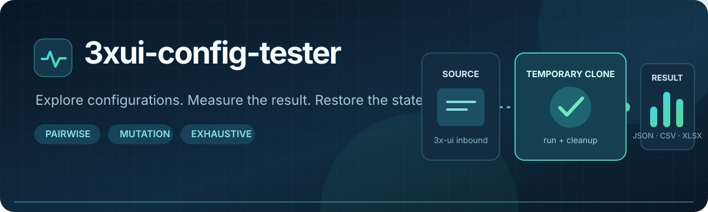

<p align="center">
  <a href="README.md">English</a> · <a href="README.ru_RU.md">Русский</a>
</p>

<p align="center">
  
</p>

<p align="center">
  <a href="https://github.com/OctoberIsTired/3xui-tester/actions/workflows/tests.yml"></a>
  
</p>

# 3xui-tester

`3xui-tester` проверяет варианты конфигурации inbound в 3x-ui/Xray. Он читает
OpenAPI работающей панели, получает исходный inbound, создаёт временный клон
и запускает локальный Xray-клиент для измерений. Результат каждого повтора
записывается в журнал, чтобы эксперимент можно было продолжить.

Проект проверен с 3x-ui v3.8.0 и Xray v26.9.9. Совместимость конкретной панели
проверяется перед изменением inbound: если её OpenAPI не содержит нужных
операций, запуск завершается до каких-либо изменений.

## Навигация

- [Требования](#требования) — что нужно до первого запуска.
- [Быстрый старт](#быстрый-старт) — минимум действий до preview.
- [Пошаговая инструкция](#пошаговая-инструкция) — от пустой папки до полного плана.
- [SSH-туннель к API 3x-ui](#ssh-туннель-к-api-3x-ui) — доступ к панели на сервере.
- [Web UI](#web-ui) — единственный способ запуска: настройка и управление в браузере.
- [Конфигурация](#конфигурация) — ключевые поля и параметры.
- [Результаты и восстановление](#результаты-и-восстановление) — файлы, остановка и отчёты.
- [Частые проблемы](#частые-проблемы) — таблица симптомов.
- [ARCHITECTURE.md](ARCHITECTURE.md) — компоненты и жизненный цикл.

## Возможности

- Стратегии подбора: `mutation`, `pairwise` и `exhaustive`, с лимитом
  `testing.max_combinations`.
- Параметры inbound и локального Xray-клиента, условия и нормализация
  неактивных параметров.
- Проверка клиентского конфига локальным Xray (`run -test`) до изменения
  inbound и до попытки подключения: несовместимые сочетания получают статус
  `SKIPPED` с кодом `client_config_*`.
- Список REALITY-целей (`testing.reality.candidates_file`), проверяемых со
  стороны панели.
- Измерения TCP, ICMP, HTTP latency/p95, стабильности и, по желанию,
  ограниченной загрузки.
- Режим `clone` по умолчанию; режим `existing` требует `allow_existing: true`
  и сохраняет снимок исходного inbound для восстановления.
- Durable-журнал и CSV/JSON/XLSX-экспорт.
- Управление только через локальный Web UI, привязанный к `127.0.0.1`.

## Требования

- Git.
- [uv](https://docs.astral.sh/uv/getting-started/installation/), Python 3.12
  или новее.
- Бинарный файл Xray, доступный машине, на которой выполняется тест, —
  не только серверный Xray в составе 3x-ui.
- Сетевой доступ к 3x-ui API и к публичному адресу тестового inbound.
- Учётные данные панели: предпочтительно API token.

Для настоящего теста машина запуска должна иметь доступ к clone inbound. На
практике это обычно Linux-сервер с 3x-ui. Windows подходит для локальной
разработки, preview и управления удалённой панелью, если на нём есть Xray и
маршрут до тестового inbound.

## Быстрый старт

1. Скопируйте `configs/example.yaml` в отдельный локальный файл, например
   `configs/local.yaml`.
2. Укажите `panel.url`, `inbound.source_id`, публичный
   `testing.server_address` и путь `testing.xray_binary`.
   Для REALITY при исходном TLS задайте также `testing.reality.target` и
   `testing.reality.server_names`.
3. Передайте секрет через переменную окружения, а не в YAML.
4. Запустите Web UI, проверьте план на вкладке «План», затем проверьте
   достижимость тестового адреса и порта с машины запуска перед реальным
   тестом.

Конфигурация подставляет переменные вида `${PANEL_API_TOKEN}` из окружения.
Не добавляйте токены и пароли в Git. Детали по каждому шагу — ниже.

```bash
git clone https://github.com/OctoberIsTired/3xui-tester.git
cd 3xui-tester
uv sync --extra dev
cp configs/example.yaml configs/local.yaml
export PANEL_API_TOKEN='replace-with-token'
```

```bash
uv run 3xui-tester --config configs/local.yaml --port 8765
```

Откройте `http://127.0.0.1:8765` **на той же машине**. Вся настройка, preview
и запуск выполняются в браузере; отдельного CLI-режима у утилиты нет.

## Пошаговая инструкция

Инструкция ведёт от пустой рабочей папки до первого отчёта. Команды
выполняются **на машине с тестером**. Панель 3x-ui и Xray inbound могут работать
на другом сервере.

В примерах замените `panel.example.com`, `vpn.example.com`, ID `4`, порт `2054`
и пути к Xray на свои значения. Сначала используйте режим `clone`: тестер создаёт
временный inbound на отдельном порту, а исходный inbound остаётся без изменений.
Настоящий запуск всё же создаёт, обновляет и удаляет этот временный inbound в
панели и отправляет сетевые запросы.

### 1. Подготовьте панель и сеть

Перед установкой соберите следующие данные:

| Что нужно | Где взять и зачем |
| --- | --- |
| URL API панели | Адрес 3x-ui, доступный с машины тестера, например `https://panel.example.com` или локальный конец SSH-туннеля. Укажите базовый URL, без `/panel/api/...`. |
| API token | Токен для запросов к панели. В конфигурации будет ссылка на переменную окружения, а не сам токен. |
| ID исходного inbound | Число из списка inbound панели. Из него будет создан клон. |
| Адрес Xray сервера | IP или домен, к которому подключится локальный Xray-клиент. Это обычно **не** адрес API панели. |
| Порт для клона | Свободный TCP-порт на сервере с 3x-ui, доступный с машины тестера. Для KCP/mKCP потребуется также UDP. |
| Файл Xray | Исполняемый файл Xray для **машины тестера**, а не только серверный Xray в составе 3x-ui. |

Исходный inbound должен содержать хотя бы одного клиента и использовать `vless`,
`vmess`, `trojan` или `shadowsocks`. Для проверки берётся первый клиент. Убедитесь,
что к выбранному порту ведёт маршрут и его пропускают firewall и правила
провайдера. Preview и загрузка inbound эту доступность не проверяют.

Если API панели слушает только `127.0.0.1` на удалённом сервере, откройте
**отдельный терминал на машине тестера** и оставьте туннель работающим:

```bash
ssh -N -L 2054:127.0.0.1:2054 user@server
```

Первый `2054` — локальный порт машины тестера, второй — порт панели на сервере.
Тогда в YAML используйте `panel.url: "http://127.0.0.1:2054"` либо `https`, если
панель действительно работает по HTTPS. Подробнее — в разделе
[SSH-туннель к API 3x-ui](#ssh-туннель-к-api-3x-ui).

### 2. Установите инструменты

Нужны Git, [uv](https://docs.astral.sh/uv/getting-started/installation/),
Python 3.12+ и Xray. Если Git и uv уже установлены, проверьте их:

```text
git --version
uv --version
```

Установщик uv из [официальной документации](https://docs.astral.sh/uv/getting-started/installation/):

**Linux (bash):**

```bash
curl -LsSf https://astral.sh/uv/install.sh | sh
```

**Windows (PowerShell):**

```powershell
powershell -ExecutionPolicy ByPass -c "irm https://astral.sh/uv/install.ps1 | iex"
```

После установки откройте новый терминал и выполните `uv --version`. Если Python
3.12+ ещё нет, uv может установить его для проекта:

```text
uv python install 3.12
```

Для локального Xray используйте уже установленный исполняемый файл или скачайте
архив для своей ОС и архитектуры из
[официальных выпусков Xray-core](https://github.com/XTLS/Xray-core/releases).
Распакуйте его на **машине тестера**, запомните путь к `xray`/`xray.exe` и
проверьте запуск. Примеры путей ниже нужно заменить на фактические:

```bash
# Linux
/usr/local/x-ui/bin/xray-linux-amd64 version
```

```powershell
# Windows: если архив распакован в .tools/xray внутри проекта
& ".\.tools\xray\xray.exe" version
```

На Linux путь из примера существует только при соответствующей установке
3x-ui. Если тестер запущен на другой машине, перенесите или установите Xray
туда и укажите путь к **локальному** исполняемому файлу. Этот же бинарник
используется для проверки клиентских конфигов в режиме `run -test`.

### 3. Скачайте проект и зависимости

**Linux (bash):**

```bash
git clone https://github.com/OctoberIsTired/3xui-tester.git
cd 3xui-tester
uv sync
cp configs/example.yaml configs/local.yaml
```

**Windows (PowerShell):**

```powershell
git clone https://github.com/OctoberIsTired/3xui-tester.git
Set-Location 3xui-tester
uv sync
Copy-Item configs/example.yaml configs/local.yaml
```

Файл `configs/local.yaml` исключён из Git. Команды далее выполняйте из корня
репозитория; `uv run` использует установленное окружение проекта.

### 4. Укажите токен и настройте `configs/local.yaml`

Переменная окружения действует в **текущем терминале**. После открытия нового
терминала установите её снова, прежде чем запускать Web UI.

**Linux (bash):**

```bash
export PANEL_API_TOKEN='ваш-токен'
```

**Windows (PowerShell):**

```powershell
$env:PANEL_API_TOKEN = 'ваш-токен'
```

Откройте `configs/local.yaml` в редакторе и измените существующие поля. Не
заменяйте весь файл фрагментом ниже: в образце также находятся параметры,
тайм-ауты и настройки измерений.

```yaml
panel:
  url: "https://panel.example.com"
  api_token: "${PANEL_API_TOKEN}"
  verify_tls: true

inbound:
  mode: clone
  source_id: 4
  test_port: 24443

testing:
  server_address: "vpn.example.com"
  xray_binary: "/путь/к/локальному/xray"
  runs_per_combination: 1
  max_combinations: 50
  urls: ["https://example.com"]
  speed_test: {enabled: false, url: "https://example.com/test.bin", max_bytes: 5000000}

output:
  directory: "./results-first-run"
```

Для Windows путь к бинарнику удобно записать с прямыми слешами, например
`xray_binary: ".tools/xray/xray.exe"`. Выберите реальный `test_port`, отличный
от порта API панели, если оба сервиса работают на одном сервере. `urls` —
адреса для HTTP-измерений через Xray; используйте разрешённый и доступный
ресурс. Для первого запуска загрузочный speed test выключен. После проверки
сети можно включить его с собственным URL и ограничением `max_bytes`.

В исходном `configs/example.yaml` уже есть строки для всех этих полей, кроме
`inbound.test_port`: добавьте её внутри раздела `inbound`. Для первого прогона
измените существующие `runs_per_combination`, `speed_test` и
`output.directory`; не создавайте в YAML два одинаковых ключа. Значения
`max_combinations: 50` и стратегия `pairwise` могут оставаться как в образце:
лимит `1` на вкладке «План» (шаг 6) всё равно ограничит первый запуск одним
кандидатом. Если тестовый порт не задан, программа ищет локально свободный порт
из `testing.port_range`; при удалённой панели эта проверка не гарантирует,
что порт свободен **на сервере**. Для первого запуска удобнее указать порт явно.

Параметр `panel.trust_env` по умолчанию равен `false`: запросы к панели не идут
через системный HTTP proxy. Если вашей панели нужен именно такой proxy,
добавьте `trust_env: true` в раздел `panel`. При ошибке TLS исправьте сертификат
или имя в `panel.url`; `verify_tls: false` используйте только для осознанной
локальной проверки.

Чтобы включить REALITY при исходном inbound на TLS, задайте
`testing.reality.target` (TLS-цель вида `www.example.com:443`) и
`testing.reality.server_names` (SNI, согласованные с её сертификатом). В образце
они закомментированы, чтобы вы выбрали подходящую цель сами. Ключи X25519 и
`shortId` тестер создаёт автоматически на один эксперимент. Вместо одной цели
можно задать список — см. [Конфигурация](#конфигурация).

### 5. Запустите Web UI и проверьте конфигурацию

Запустите backend из корня репозитория; команда одинакова для bash и
PowerShell:

```text
uv run 3xui-tester --config configs/local.yaml --port 8765
```

Откройте `http://127.0.0.1:8765` **на той же машине**. На вкладке «План»
нажмите «Рассчитать план»: это только читает YAML и строит план локально, к
панели он не подключается. Посмотрите `Strategy`, `Planned combinations` и
первые комбинации. Ошибка YAML означает неверные отступы или тип значения в
конфигурации.

Затем в разделе «Подключение» загрузите список inbound: это проверяет доступ
к панели и её OpenAPI. ID в `inbound.source_id` должен соответствовать нужной
строке списка.

Preview предупреждает о возможных проблемах без изменения inbound. Если
исходный inbound использует TLS, а поля REALITY не заданы, кандидаты REALITY
будут пропущены. Тестер проверяет формат target и согласованность SNI, но не
проверяет доступность цели по сети: её нужно проверить с самого сервера Xray.
В режиме списка целей перед запуском панель проверяет каждую пару через API
`scanRealityTarget` со своей стороны до изменения inbound; старая панель без
этого API останавливает запуск с ошибкой.

Порт клона должен быть доступен с машины, запускающей тестер: preview **не
проверяет** подключение к тестовому порту и работу URL измерений.
Автоматический выбор порта проверяет его доступность только локально, а не на
сервере. Образец конфигурации перебирает TLS, REALITY и разные транспорты без
привязки к конкретному исходному inbound, поэтому Xray может отклонить часть
сочетаний. Для KCP нужен доступ по UDP, а для TLS важны сертификат и имя
сервера. Перед настоящим запуском убедитесь, что выбранный тестовый порт
свободен на сервере и будет доступен с машины тестера: до создания клона
проверка соединения с этим портом ожидаемо может не пройти.

### 6. Выполните первый короткий запуск

Убедитесь, что в YAML стоит `inbound.mode: clone`, `runs_per_combination: 1`,
`speed_test.enabled: false` и отдельный каталог `./results-first-run`, а на
вкладке «План» задан лимит числа конфигураций `1`. Затем на вкладке «Запуск и
результаты» начните тест.

Лимит `1` означает **одну конфигурацию**, а не один HTTP-запрос. При
`runs_per_combination: 1` она измеряется один раз. Программа создаёт
временный inbound, применяет конфигурацию, запускает локальный Xray-клиент,
записывает результат и пытается удалить клон при завершении. Сводка содержит
`completed`, `failed`, `termination_reason`, а при проблемах очистки или
экспорта — также `cleanup_error`/`export_error`.

Если `failed` больше нуля, откройте `results.jsonl` и посмотрите
`result.status`, `result.stage` и `result.error_message` либо
`result.gate_failures`. Первый кандидат плана тоже может оказаться
несовместимым: например, Xray отклоняет VLESS без шифрования к публичному
адресу. Такой кандидат отсеивается локальным Xray (`run -test`) до изменения
inbound и записывается как `SKIPPED` с кодом `client_config_*`, а не как
неудачная попытка подключения. Чтобы отдельно проверить рабочий исходный
inbound, временно задайте `parameters: {}` и новый `output.directory`,
повторите проверку плана и запуск; перед полным планом верните параметры
поиска.

После окончания проверьте в панели, что inbound с пометкой
`[3xui-tester:...]` удалён. Если процесс аварийно завершился или панель была
недоступна во время очистки, клон может остаться: найдите именно его по этой
пометке и проверьте вручную перед новым запуском. Не удаляйте исходный
inbound.

### 7. Посмотрите результаты и запустите полный план

Каждый запуск Web UI пишет результаты в отдельный каталог внутри
`output.directory/runs/`: журнал `results.jsonl`, checkpoint `state.json`,
`errors.jsonl` при неудачных повторах и экспорт согласно `output.formats`.
Готовые отчёты можно скачать из истории запусков. Состав файлов описан в
разделе [Результаты и восстановление](#результаты-и-восстановление).

Если первый прогон прошёл и вы хотите более надёжное сравнение, измените
`testing.runs_per_combination` (например, на `5`), выберите нужные параметры,
стратегию и лимит. При включении `speed_test` укажите разрешённый URL и
разумный `max_bytes`. Каждый следующий запуск получает собственный каталог
результатов, поэтому журналы экспериментов не смешиваются. Повторите проверку
плана и запустите тест с лимитом, например, в `50` конфигураций.

Число 50 здесь — верхняя граница конфигураций; фактический план может быть
меньше. Учитывайте также число повторов, запросов измерений и сетевую
нагрузку. После завершения проверьте в сводке `configurations_tested`,
`failed` и `termination_reason`, а также файлы `results.jsonl` и, если были
неудачные повторы, `errors.jsonl`.

### 8. Остановка

Для штатной остановки теста нажмите «Остановить» на вкладке «Запуск и
результаты»: runner завершит текущий повтор, удалит клон (или восстановит
исходный inbound в режиме `existing`) и сохранит checkpoint и экспорт.
Остановка самого Web UI (`Ctrl+C` в его терминале; на Linux также `SIGTERM`)
сначала останавливает выполняющийся тест. При аварийном завершении
автоматическая очистка может не выполниться — проверьте панель вручную.
Прерванный эксперимент можно повторить новым запуском с теми же параметрами
и лимитами; результаты будут записаны в новый каталог внутри
`output.directory/runs/`.

## SSH-туннель к API 3x-ui

Если тестер запущен на рабочей станции, а API 3x-ui доступен только на сервере,
пробросьте порт панели через SSH. Так тестер сможет обращаться к API управления
inbound без публикации порта панели в интернете:

```bash
ssh -N -L 2054:127.0.0.1:2054 user@server
```

Оставьте SSH-команду работающей в отдельном терминале на время работы Web UI.
Первый `2054` — локальный порт рабочей станции, а
`127.0.0.1:2054` — адрес API панели с точки зрения сервера. Если панель
слушает другой порт, замените числа. В конфигурации укажите локальный конец
туннеля с фактической схемой HTTP или HTTPS панели:

```yaml
panel:
  url: "https://127.0.0.1:2054"
testing:
  server_address: "vpn.example.com"
```

`panel.url` нужен для запросов к API 3x-ui. `testing.server_address` — адрес
Xray inbound на сервере, доступный тестовому клиенту. Порт тестового inbound
(`inbound.test_port`, если задан) должен быть доступен с машины запуска
отдельно: SSH-туннель к API не передаёт тестовый трафик. Если тестер запущен
на том же сервере, что и 3x-ui, можно указать локальный URL панели без SSH.
Туннель к Web UI и туннель к API панели решают разные задачи.

## Web UI

Локальная веб панель состоит из четырёх разделов:

| Раздел | Возможности |
| --- | --- |
| Подключение | Создание YAML с нуля: адрес панели, ID исходного inbound, порт копии, адрес сервера, путь к Xray, TLS, URL измерений и загрузка списка REALITY-целей. |
| Параметры | Каталог параметров из API панели, фиксация исходной конфигурации, собственные пути Xray. |
| План | Стратегия поиска, лимиты, пороги качества и предварительный просмотр комбинаций. |
| Запуск и результаты | Запуск и остановка теста, текущие метрики, история запусков и скачивание отчётов JSON, CSV, XLSX. |

Задайте переменную `PANEL_API_TOKEN` и запустите панель из корня репозитория.
Файл `configs/local.yaml` заранее создавать не нужно:

```bash
uv run 3xui-tester --port 8765
```

Откройте `http://127.0.0.1:8765`, укажите адрес панели и загрузите список
inbound. Выберите исходный ID, заполните остальные поля подключения и нажмите
«Сохранить конфигурацию YAML». Затем выберите параметры эксперимента. По
умолчанию UI создаёт `configs/local.yaml`;
другой путь можно указать через `--config`. UI читает и сохраняет этот файл,
показывает inbound и запускает тест в фоне. Каждый запуск UI записывает в
отдельный каталог `output.directory/runs/<время>-<id>`; история и ссылки на
готовые отчёты доступны после обновления страницы. Учётные данные не
передаются браузеру; UI не требует авторизации, поэтому оставляйте его
доступным только локально. Если Web UI запущен на удалённом сервере,
пробросьте его порт отдельно для доступа из локального браузера:

```bash
ssh -L 8765:127.0.0.1:8765 user@server
```

После этого откройте локальный адрес в браузере рабочей станции.

Запросы к API панели по умолчанию идут напрямую, минуя системный HTTP proxy.
Если для доступа к панели нужен именно proxy, включите «Использовать системный
proxy» в разделе «Подключение».

## Конфигурация

Полный пример находится в `configs/example.yaml`. Важные поля:

| Поле | Назначение |
| --- | --- |
| `panel.url` | Базовый URL 3x-ui без пути конкретной страницы. |
| `panel.api_token` | API token, обычно `${PANEL_API_TOKEN}`. |
| `inbound.source_id` | ID inbound, от которого создаётся clone. |
| `inbound.mode` | `clone` по умолчанию; `existing` требует `allow_existing: true`. |
| `inbound.test_port` | Необязательный фиксированный порт клона; если он не задан, выбирается первый локально свободный порт из `testing.port_range`. |
| `testing.server_address` | Публичный адрес clone inbound, а не URL панели. |
| `testing.xray_binary` | Путь к локальному бинарнику Xray; он же проверяет клиентские конфиги. |
| `testing.validate_config` | `true` по умолчанию: отклонять конфиги, которые не принимает локальный `xray run -test`. |
| `testing.reality.target` | TLS-цель на стороне сервера в формате `hostname:port`; нужна для REALITY при исходном TLS. |
| `testing.reality.server_names` | Список имён SNI, согласованных с сертификатом цели REALITY. |
| `testing.reality.candidates_file` | Список пар target/SNI вместо одного `target`/`server_names`; путь относительно YAML. |
| `testing.urls` | URL для HTTP-измерений через локальный SOCKS-прокси. |
| `testing.combination_strategy` | `mutation`, `pairwise` или `exhaustive`; по умолчанию `pairwise`. |
| `testing.max_combinations` | Жёсткий лимит проверяемых конфигураций. |
| `testing.runs_per_combination` | Число повторов каждой конфигурации; 5 позволяет сравнивать средние и стандартное отклонение. |
| `testing.max_failed_runs` | Сколько неудачных повторов допускается до прекращения проверки конфигурации. |
| `output.directory` | Каталог с результатами и checkpoint. |

Для автоматического построения клиентской конфигурации исходный inbound должен
содержать хотя бы одного клиента и использовать `vless`, `vmess`, `trojan` или
`shadowsocks`. Для теста берётся первый клиент из исходного inbound.

Параметр задаёт тип, набор значений, JSON path, target и необязательное условие:

```yaml
parameters:
  network:
    type: enum
    values: [tcp, kcp, ws, grpc, httpupgrade, xhttp]
    mutate: true
    target: inbound
    path: [streamSettings, network]

  mux:
    type: boolean
    values: [true, false]
    target: client
    path: [outbounds, 0, mux, enabled]
```

`target: inbound` изменяет тестовый inbound, а `target: client` — только
локальную конфигурацию Xray. В режиме `existing` тестовый inbound совпадает
с исходным. Условия поддерживают `equals`, `not_equals`, `in`, `not_in`,
`exists`, `all` и `any`.

KCP/mKCP использует UDP, поэтому UDP-трафик на тестовом порту должен быть
разрешён firewall и проброшен до Xray. Для TLS gRPC нужен ALPN `h2`. VLESS
`xtls-rprx-vision` применяется только к TCP с TLS или REALITY; runner удаляет
унаследованный flow при переключении на другой транспорт или режим защиты.
Для REALITY ключи X25519 и `shortId` создаются автоматически один раз на
эксперимент. В `configs/example.yaml` target и SNI оставлены закомментированными:
выберите подходящую для своего сервера цель и проверьте её доступность отдельно.

Вместо одной цели можно задать список: `testing.reality.candidates_file:
reality-targets.yaml` в конфиге под `configs/`, либо загрузить YAML-файл в
разделе «Подключение» Web UI. Файл содержит записи `targets:` с полями `target`
(`host:port`) и `server_name` (одно имя SNI). Поставляемый
[`configs/reality-targets.yaml`](configs/reality-targets.yaml) содержит десять
заготовок из 3x-ui; перед запуском панель проверяет каждую пару со своей
стороны. Загруженный через UI список сохраняется в YAML как
`testing.reality.candidates`, поэтому следующие запуски используют тот же набор.
Используйте список **вместо** полей `target`/`server_names` и включите `reality`
в параметр `security`. Отдельные параметры клиентского SNI и ключа REALITY
несовместимы с режимом списка: SNI клиента определяется выбранной целью. В
разделе «Параметры» клиентские параметры `serverName`, `shortId`, `password` и
`publicKey` REALITY помечаются как управляемые списком, пока он загружен: их
значения не попадают в конфиг.

## Результаты и восстановление

После первого завершённого повтора в `output.directory` появляется
`results.jsonl` (журнал повторов), а `state.json` хранит checkpoint.
При неудачных повторах появляется `errors.jsonl`. По окончании запуска
экспорт создаёт `results.json` при
`formats: [json]`, `results.csv` и `summary.csv` при `formats: [csv]`,
`results.xlsx` при `formats: [xlsx]`. Экспортные файлы пересобираются из
`results.jsonl`.

Перед каждым запуском тестер выполняет короткую
screening-проверку трёх профилей на временном inbound: TCP+TLS, TCP+REALITY и
XHTTP+REALITY (path `/`, mode `auto`). Недоступные по исходным настройкам
профили помечаются как пропущенные. Очищенные результаты записываются в
`diagnostics.jsonl`; неудача контрольной проверки не останавливает основной
план. Ping и измерение скорости в контроль не входят.

После запуска проверьте `failed` в сводке и `result.status` в
`results.jsonl`: успешно завершившийся запуск может содержать неудачные
конфигурации. Например, Xray отклоняет VLESS без шифрования при подключении
к публичному адресу сервера. Невыполнимые сочетания записываются один раз со
статусом `SKIPPED` и кодом причины до изменения inbound; в сводке пропуски
отделены от сетевых ошибок. Перед изменением inbound клиентский конфиг
проверяется локальным Xray в режиме `xray run -test`: структурные правила
плюс вердикт самого ядра о неизвестном транспорте или шифре, параметрах
REALITY и недопустимом адресе назначения. Такие конфигурации получают
`SKIPPED` с кодом `client_config_*` вместо неудачной попытки подключения.
Проверка отключается через `testing.validate_config: false`, таймаут задаёт
`timeouts.xray_config_test`. Если локальный бинарник недоступен, проверяется
только структура, а причина попадает в предупреждения. Предупреждения укажут
на короткий timeout screening и на то, что `testing.max_failed_runs` может
сократить фактическое число повторов.

Каждый запуск Web UI получает собственный каталог внутри
`output.directory/runs/`, поэтому журналы экспериментов не смешиваются;
`state.json` внутри него — checkpoint этого запуска. Ключи REALITY и `shortId`
хранятся в обычном JSON-файле `.reality-credentials.json` в каталоге запуска.
Не публикуйте этот файл: ключи не выводятся в Web UI, журналы результатов
и экспорт. В `results.xlsx` номер `#N` на диаграммах и в рейтинге листа
`Dashboard` соответствует строке `#N` на листе `Candidates`. Рядом указаны
все параметры, ID теста и хеш конфигурации. Оси диаграмм подписаны названиями
измерений и единицами: задержка — мс, скорость — Мбит/с, балл — от 0 до 1.

При штатной остановке и ошибке runner пытается удалить клон или восстановить
исходный inbound в режиме `existing`, затем сохраняет checkpoint и экспорт.
На Windows останавливайте Web UI через `Ctrl+C`; на Linux также обрабатывается
`SIGTERM`. После аварийного завершения процесса проверьте панель вручную:
временный клон помечается префиксом `[3xui-tester:` в `remark`, а при
`existing` снимок находится в `source-inbound-backup.json`. Снимок содержит
полный payload, включая потенциально чувствительные данные; на Ubuntu файл
получает права `0600`.

## Частые проблемы

| Симптом | Что проверить |
| --- | --- |
| `uv` не найден | Откройте новый терминал после установки и выполните `uv --version`. |
| `Set panel.api_token or PANEL_USERNAME/PANEL_PASSWORD` | Установите `PANEL_API_TOKEN` в том же терминале, где запущен Web UI. В YAML оставьте `${PANEL_API_TOKEN}`. |
| Ошибка авторизации или подключения к панели | Проверьте `panel.url`, токен, схему `http`/`https`, SSH-туннель и доступность API. При использовании системного proxy проверьте `panel.trust_env`. |
| Ошибка сертификата TLS | Проверьте, соответствует ли сертификат имени в `panel.url`. Для SSH-туннеля `https://127.0.0.1` может не совпасть с именем сертификата. |
| `Panel OpenAPI lacks required paths` | Запущенная панель не предоставляет операции, которые требует адаптер. Проверьте версию и URL панели; не запускайте тест наугад. |
| `Configured test_port ... is already used` | Выберите другой свободный порт клона на сервере и обновите `inbound.test_port`. |
| Xray на панели не запущен | Проверьте состояние Xray в 3x-ui; preflight прервётся до эксперимента. |
| `XRAY_ERROR` | Проверьте путь `testing.xray_binary`, права запуска, совместимость параметров и локальный вывод Xray. |
| `client_config_*` со статусом `SKIPPED` | Локальный Xray отклонил клиентский конфиг; `reason_code` указывает причину (транспорт, шифр, параметры REALITY, адрес назначения). Уберите несовместимое значение из `parameters` или проверьте `testing.server_address`. |
| Предупреждение «The local Xray config check is unavailable» | Локальный бинарник не найден, не поддерживает `-test` или не отвечает: проверяется только структура конфига. Проверьте `testing.xray_binary` или отключите вызов ядра через `testing.validate_config: false`. |
| `TIMEOUT` или неудачные HTTP-измерения | Проверьте маршрут до `testing.server_address`, тестовый порт, firewall, DNS и доступность `testing.urls` через тестовое подключение. |
| В панели остался clone | Найдите inbound по уникальной пометке `[3xui-tester:...]`; после проверки его назначения удалите вручную. |

## Безопасность

- `clone` используется по умолчанию: тестовый inbound помечается
  `[3xui-tester:...]` и удаляется при штатной очистке.
- Режим `existing` временно изменяет исходный inbound и требует
  `inbound.allow_existing: true`; для восстановления записывается полный
  `source-inbound-backup.json`, который может содержать чувствительные данные.
- Аварийное завершение процесса или недоступность панели могут помешать
  автоматической очистке. После аномального завершения проверьте панель вручную.
- Тестируйте только панели, inbound и измерительные URL, на которые у вас есть
  разрешение. Для throughput укажите собственный разрешённый URL и лимитируйте
  `speed_test.max_bytes`.

## Разработка

```bash
uv sync --extra dev
uv run pytest
```

Правила для агентов и карта исходников находятся в [AGENTS.md](AGENTS.md),
устройство приложения — в [ARCHITECTURE.md](ARCHITECTURE.md).
